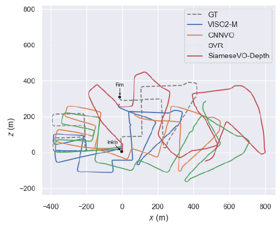

# SiameseVO-Depth: Visual Odometry through Siamese Neural  Networks

**Abstract**: Visual Odometry is an important process in image based navigation of robots. The standard methods of this field rely on the good feature matching between frames where feature detection on images stands as a well adressed problem within Computer Vision. Such techniques are subject to illumination problems, noise and poor feature localization accuracy. Thus, 3D information on a scene may mitigate the uncertainty of the featureson images. Deep Learning techniques show great results when dealing with common difficulties of VO such as low illumination conditions and bad feature selection. While Visual Odometry and Deep Learning have been connected previously, no techniques applying Siamese Convolutional Networks on depth infomation given by disparity maps have been acknowledged as far as this work’s researches went. This work aims to fill this gap by applying Deep Learning to estimate egomotion through disparity maps on an Siamese architeture. The SiameseVO-Depth architeture is compared to state of the art techniques on OV by using the KITTI Vision Benchmark Suite. The results reveal that the chosen methodology succeeded on the estimation of Visual Odometry although it doesn’t outperform the state-of-the-art techniques. This work presents fewer steps in relation to standard VO techniques for it consists of an end-to-end solution and demonstrates a new approach of Deep Learning applied to Visual Odometry.

The comparison of ours proposal method to techniques **VISO2-M**, **CNNVO**, **SVR** and the **Ground Truth** in the **Kitti Benchmark Dataset** is shown bellow:

**Sequence 08**

**Sequence 09**

**Sequence 10**

